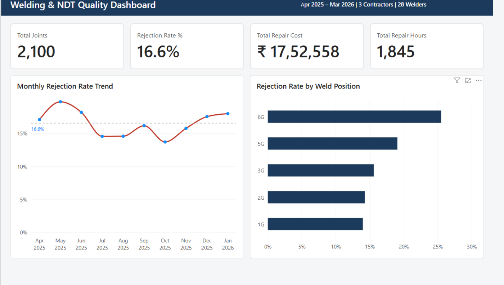
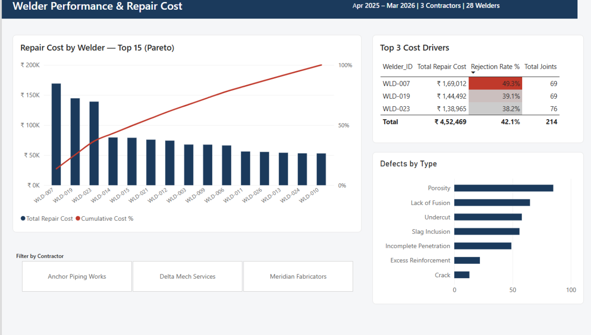
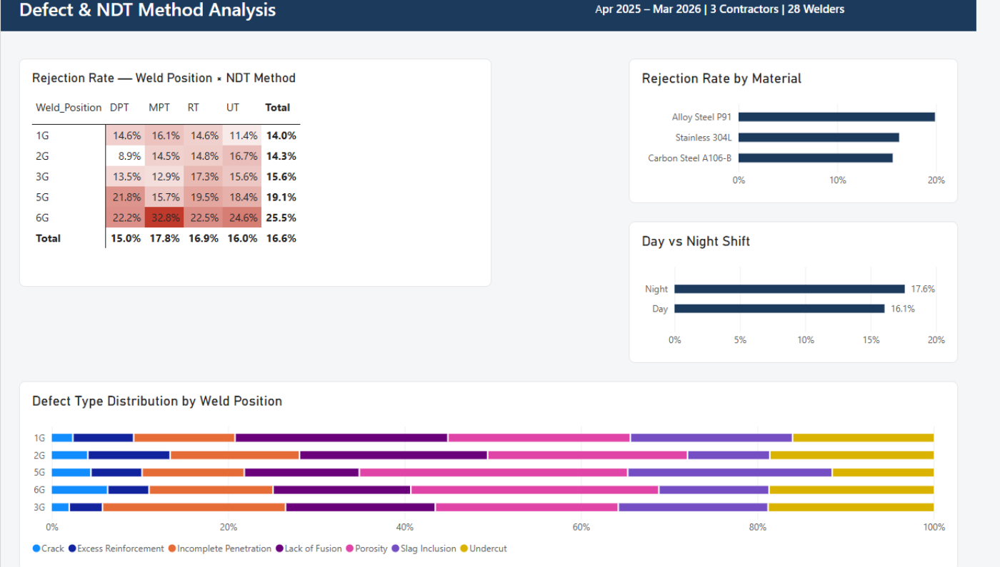
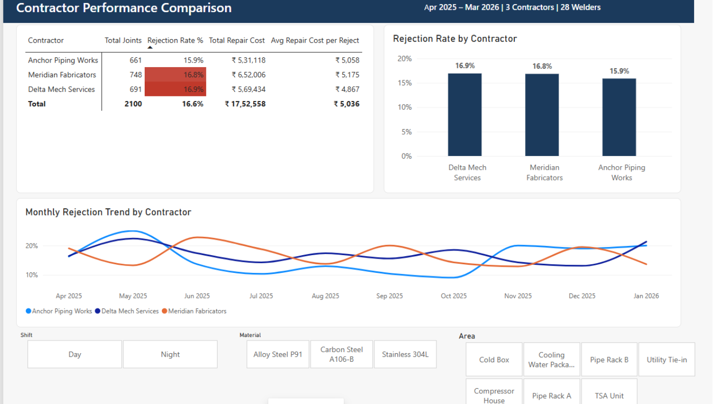

# Welding & NDT Quality Dashboard

**A four-page Power BI dashboard over 12 months of weld inspection data that located where rework money actually goes — three welders producing 10.2% of the volume and 25.8% of the repair cost.**

---

## The problem

A fabrication contractor inspecting thousands of weld joints a year knows its overall rejection rate. What it usually cannot answer is *where that rejection rate comes from* — which welders, which weld positions, which materials, and what each of those costs.

The data exists. It sits in inspection registers and NDT report logs, recorded joint by joint, complete and unanalysed. The result is that rework budget gets treated as a fixed cost of doing business instead of something with identifiable, addressable causes.

This project takes a 12-month inspection log — **2,100 joints, 28 welders, 3 contractors, 7 plant areas** — and turns it into a four-page decision tool.

*Synthetic dataset, modelled on real fabrication inspection register structure.*

---

## What it found

### Rework cost is concentrated in three people

Three welders performed 214 joints — **10.2% of total volume** — but generated **₹4,52,469 in repair cost, 25.8% of all rework spend**.

Their individual rejection rates were 49.3%, 39.1% and 38.2%, against a site average of **16.6%**. Their workloads were normal: 69, 69 and 76 joints against a 75-joint average. The rates are not a small-sample artefact.

**Action indicated:** requalification testing for three named welders. Not a site-wide retraining programme.

### Weld position drives failure; inspection method does not

Cross-tabulating rejection rate by weld position and NDT method produced a clear gradient by position — **6G at 25.5%** against the 16.6% site average — and no meaningful variation by inspection method. The difficulty is in the joint, not in how it is examined.

**Action indicated:** position-specific qualification and fit-up control, rather than changes to inspection coverage.

### Contractor comparison separates volume from quality

Highest total rework cost and highest rejection rate belong to different contractors. Ranking by spend alone points at the wrong supplier.

---

## What I built

- Power Query pipeline from raw inspection register to a star-schema model
- Dedicated date table and measures table with DAX measures for rejection rate, repair cost, cost per joint and Pareto cumulative
- **Page 1** — project quality overview and KPI cards
- **Page 2** — welder ranking with Pareto concentration analysis
- **Page 3** — weld position, NDT method and defect type analysis
- **Page 4** — contractor comparison and monthly trend

A `.pbit` template is included so the model can be pointed at a different inspection register without rebuilding it.

---

## Tools

Power BI Desktop · Power Query (M) · DAX · Excel 365

## Files

| File | What it is |
|---|---|
| `case_study.md` / `case_study.pdf` | Full write-up with method and findings |
| `Welding_NDT_Dashboard.pbix` | The complete report file |
| `Welding_NDT_Dashboard_Template.pbit` | Reusable template |
| `data_dictionary.xlsx` | Column definitions and value ranges |
| `measures_list.md` | Every DAX measure and its purpose |
| `data/` · `images/` | Source dataset and page exports |

---

*I spent 12 years as a QA/QC engineer on refinery, steel plant and fabrication projects — IOCL Paradip, Jindal Steel Angul, Tata Steel HSM, L&T Vizag. ASNT Level II in RT, UT, MT and PT. I build the reports I used to need on site.*

**More work:**  **Contact:** skbiswal5244@gmail.com
